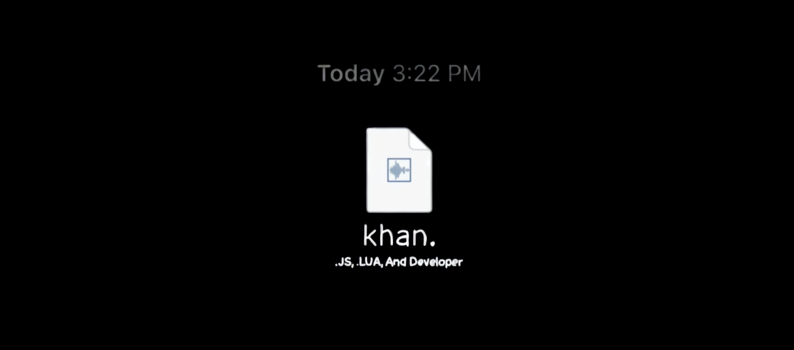

# 💫 About Me:
· Male | He/Him · Anime: NGE, CSM, Initial D · R&B, Hip Hop · CS2, OW2, FC · Experience with .LUA and .JS School: ⁠ 7:15 AM - 2:15 PM 

# 💻 Tech Stack:
      
# 📊 GitHub Stats:
 
 

## 🏆 GitHub Trophies

---

<!-- Proudly created with GPRM ( https://gprm.itsvg.in ) -->

